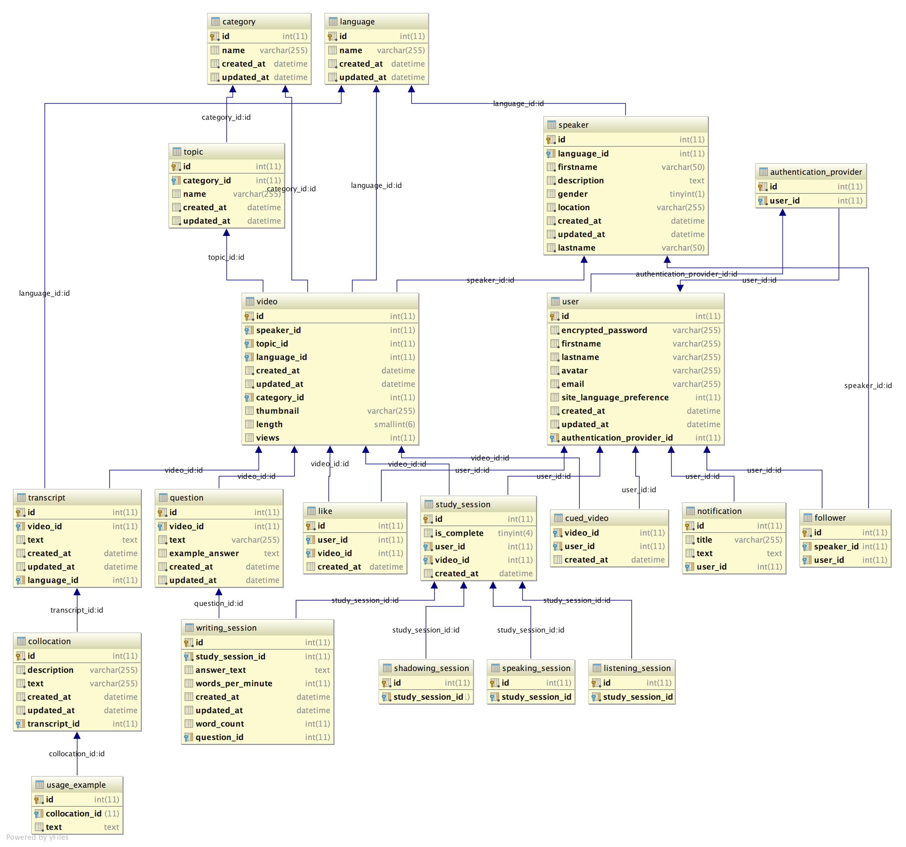
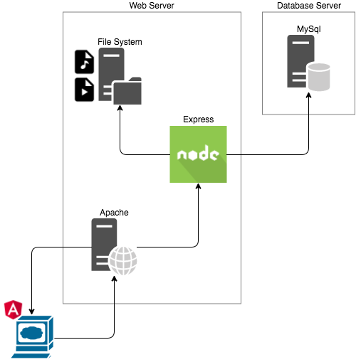

# get-native.com

Source code for get-native.com

## 1. Purpose and Goal

### 1.1 General Description
Get Native is a web application (described here forth as app) for language learning. It allows users to login, browse a database of video interviews, and view or study the original and/or translated version of the script accompanying each video.

### 1.2 Goal
This app serves as a study tool for language learners who have already reached a comfortable level of proficiency but wish to make their word choice and pronunciation sound more native-like.

### 1.3 Target Audience
The target audience of this app is the advanced language learner who wishes to bring their pronunciation and word-choice of the target language closer to that of a native speaker.

## 2. Features

### 2.1 Registration & Login
Get Native allows users to register and/or login in 1 of 3 ways:
Facebook
Gmail (Google Account)
Regular Email

### 2.2 Browse / Search Videos
The focus of Get Native is on studying video interviews. Users can browse and/or filter-search video interviews based on preset criteria. Videos are stored on the origin server and sent to the client using HTTP Range Requests [RFC 7233] via the HTML5 <video> interface. Videos are proprietary and are not available for download; however, they are free to view online.

### 2.3 Study Sessions
A Get Native Study Session is a timed exercise performed while logged into the app. The user selects a video, specifies the amount of time (in minutes) they want to study, and is led through a series of 4 language exercises utilizing the chosen video:
- Listening
- Shadowing
- Speaking
- Writing

### 2.4 Multiple language support
Get Native provides video interviews in multiple languages, which makes it possible to study multiple languages. Users can change the current Study Language at any time by hovering over the bottom right corner of the screen when logged in.

### 2.5 Interactive Tutorial
To learn about how to use Get Native, users are able to navigate through an interactive tutorial which shows and describes the various features of Get Native.

## 3. Database Schema

Below is a brief description of each table in alphabetical order.

### 3.1 authentication_provider
This table describes the type of authentication with which a users account is linked. For example some users may register with Facebook and others via email.

### 3.2 category
A category into which videos are grouped. Each video belongs to a topic, and each topic belongs to a category. An example of a category is Business.

### 3.3 collocation
A string of 1 or more words that comes directly from a transcript. 

### 3.4 cued_video
Videos have a many-to-many relationship with users through the cued_video table. A cued_video is a video that the user has added to their dashboard. By querying cued_video, we can find the selected videos for each user and prevent them from adding the same video twice.

### 3.5 followers
Users have a many-to-many relationship with speakers through the followed_speakers table. Users are able to follow speakers. When a user decides to follow a speaker, the speaker and user are linked together in the followers table.

### 3.6 language
The Study Languages supported by Get Native. The user can change the current Study Language by hovering over the Study Language view in the bottom right corner of the screen when logged in. This table is also used for video organization.

### 3.7 like
Whenever a user likes a video a new like record is created to document which user liked which video.

### 3.8 listening_session
When a user completes the listening portion of the study session, a new listening session record is created to document that completion along with any statistical data was gathered.

### 3.9 notification
Notifications that are sent to users in that users can read by clicking the notifications button at the top right of the screen.

### 3.10 question
A question is a prompt that appears on the Writing page of the Study Session. Each question has a prewritten example answer which is also visible to the user on the Writing page. In response to a question, the user writes an answer.

### 3.11 shadowing_session
When a user completes the shadowing portion of the study session, a new listening session record is created to document that completion along with any statistical data was gathered.

### 3.12 speaker
Speakers are video interviewees. Users are able to specify a certain speaker when searching for videos. Users are also able to follow certain speakers and receive notifications when that speaker releases a new video.

### 3.13 speaking_session
When a user completes the shadowing portion of the study session, a new listening session record is created to document that completion along with any statistical data was gathered.

### 3.14 study_session
Every time a user chooses to study, a new study session is created. The tables listening session shadowing session speaking session in writing session are all linked to study session so that user statistics can be gathered efficiently.

### 3.15 topic
A topic groups a small number of videos together for easy organization and searching. Each video belongs to a topic and each topic belongs to a category. An example topic is talking to customers.

### 3.16 transcript
A transcript is a written transcription of a video interview. Even though a video has only 1 corresponding language, multiple transcripts can belong to the same video if they are translations.

### 3.17 usage_example
Each collocation has 1 or more usage examples. A usage example is an example of how to use a given collocation. Usage examples are displayed when clicking on a highlighted collocation in a transcript.

### 3.18 user
Users are entities who hold Get Native accounts and are capable of logging in to the website and using its functionality.

### 3.19 video
A video record documents the video within the get-native database. It contains information about the video as well as references to media assets that correspond to the video — such as thumbnail image and video URLs.

### 3.20 writing_session
When a user completes the writing portion of the study session, a new listening session record is created to document that completion along with any statistical data was gathered. A writing session record will, for example, hold the answer text provided by the user as well as word count and word per minute statistics.

## 4. Architecture

### 4.1 Physical Machines
The production web server server will be separated from the database server for security reasons.

### 4.2 Operating System
Both the web server and database server will be built on the Ubuntu 16.04 LTS operating system.

### 4.3 Deployment
Continuous deployment is performed through Circle CI. 
A successful staging or production build prompts automatic deployment to Digital Ocean droplet.

### 4.4 Provisioning
A single Chef recipe is used to provision both staging and production environments.

| Specification                            	|                    	|
|------------------------------------------	|--------------------	|
| Operating System                         	| Ubuntu 16.04 LTS   	|
| Public domain                            	| get-native.com     	|
| Public API domain                        	| api.get-native.com 	|
| Production SSL/TLS Certificate Authority 	| letsencrypt.org    	|
| Web Server                               	| Apache 2.4         	|
| Web Server Protocol                      	| HTTP 2             	|

| Role                         	| Tool(s)                	| Programming Language  	|
|------------------------------	|------------------------	|-----------------------	|
| Deployment                   	| Circle CI / Capistrano 	| Bash / Ruby           	|
| Server Provisioning          	| Chef                   	| Ruby                  	|
| Server Application (API)     	| Express                	| JavaScript (Node.js)  	|
| Client Application (Browser) 	| Angular                	| HTML, CSS, JavaScript 	|
| Database                     	| MySql                  	| SQL                   	|
